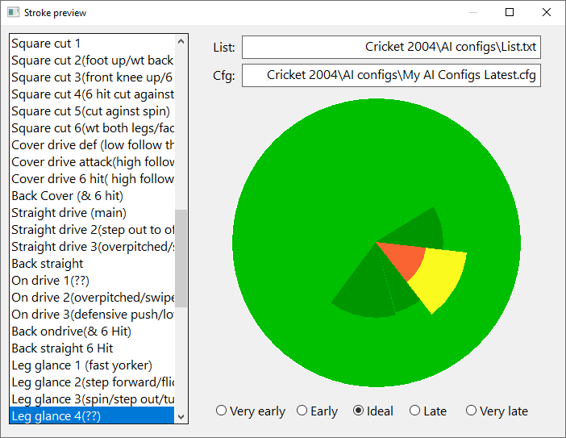

# Cricket 2004 Stroke Preview

This program previews stroke configuration files from EA Sports Cricket 2004.

## Compilation

A Rust toolchain is required. You can compile and run the stroke preview application with `cargo run --release`.

## Usage instructions

1. Open your cricket 2004 .gob file in the Cricket 2004 Config Editor by Prakash
2. Export the AI config by clicking Export AI
3. Open stroke preview
4. Enter the path to your AI cfg file and List.txt file
5. Edit strokes in your favourite text editor. On save, stroke preview will refresh automatically.
6. When you are happy, import the modified AI cfg file back into Config Editor by clicking Import AI

To save doing step 4 every time, you can create a stroke_preview.toml file in the working directory of the program containing

    cfg_file = 'path\to\AI.cfg'
    list_file = 'path\to\List.txt'

This repository contains a List.txt file sourced from the [planet cricket forum](https://www.planetcricket.org/forums/threads/updated-list-txt-with-more-bowling-options.10374/) with more stroke descriptions than the one that ships with the Config Editor.

## For developers

This app is written in Rust using the excellent [native-windows-gui](https://github.com/gabdube/native-windows-gui) library. Stroke config files are parsed using [nom](https://github.com/Geal/nom).
